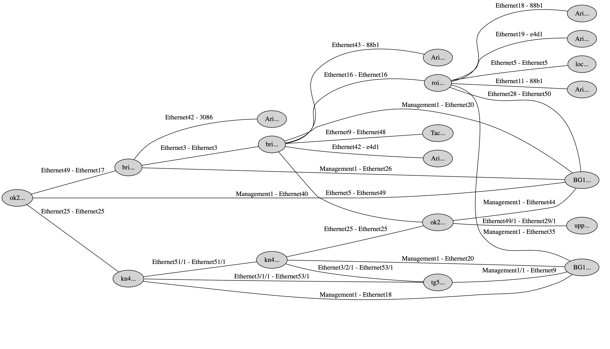

# Netmap

Netmap stands for Network Mapper, a tool that maps your inventory of network devices and creates a graph to visualize. Netmap starts collecting LLDP information with a single device credential and recursively lookup to create a graph. At the moment the tool supports only Arista devices.

## Getting Started

## Install using Curl

```
curl -s https://raw.githubusercontent.com/opennetworktools/netmap/refs/heads/main/install.sh | bash
```

## Install using Go

```
go install github.com/opennetworktools/netmap@v0.1.3
```

## Build from the source

1. Clone the repo
2. Run `go build .`
3. Run `go install`

### Using Makefile

1. Run `make`
2. Check `dist/` directory

## Usage

The graph can be created using the command `netmap create`,

```
roopesh:~/ $ netmap create --help                                                                                                                                                                         
Create topology diagram

Usage:
  netmap create

Flags:
  -h, --help              help for create
  -n, --hostname string   hostname to connect
  -p, --password string   password to connect to the host
  -u, --username string   username to connect to the host
roopesh:~/ $ netmap create -n ok270 -u admin -p password
```

<figure>
  
  <figcaption>The above graph was created by Netmap. The labels of nodes and edges are truncated for privacy concerns.</figcaption>
</figure>